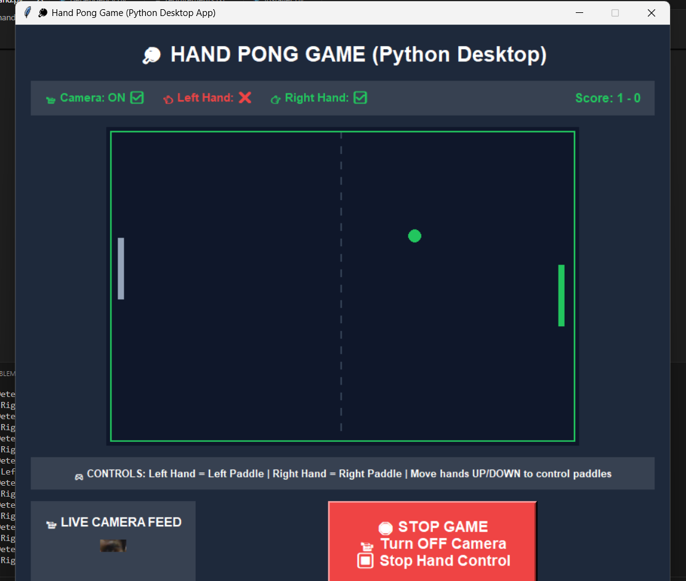

# 🏓 Hand Pong Game

A real-time hand-controlled Pong game built with Python, OpenCV, and MediaPipe. Control the paddles using your hand movements detected through your webcam!

## 🎮 Features

- **Real-time Hand Tracking**: Uses MediaPipe for accurate hand detection
- **Dual Hand Control**: Control both paddles with left and right hands
- **AI Opponent**: Smart AI takes over when hands aren't detected
- **Live Camera Feed**: See your hands with tracking landmarks
- **Smooth Gameplay**: 60 FPS game loop with responsive controls
- **Visual Feedback**: Paddles and ball change color when hands are detected
- **Score Tracking**: Keep track of your wins and losses

## 📋 Requirements

- Python 3.7 or higher
- Webcam/Camera
- Windows, macOS, or Linux

## 🚀 Installation

### Method 1: Quick Install (Recommended)

1. **Clone the repository**
   \`\`\`bash
   git clone https://github.com/yourusername/hand-pong-game.git
   cd hand-pong-game
   \`\`\`

2. **Run the installer**
   \`\`\`bash
   python installer.py
   \`\`\`

3. **Start the game**
   \`\`\`bash
   python hand.py
   \`\`\`

### Method 2: Manual Installation

1. **Clone the repository**
   \`\`\`bash
   git clone https://github.com/yourusername/hand-pong-game.git
   cd hand-pong-game
   \`\`\`

2. **Install dependencies**
   \`\`\`bash
   pip install opencv-python mediapipe pillow numpy
   \`\`\`

3. **Run the game**
   \`\`\`bash
   python hand.py
   \`\`\`

### Method 3: Using requirements.txt

1. **Clone and navigate**
   \`\`\`bash
   git clone https://github.com/yourusername/hand-pong-game.git
   cd hand-pong-game
   \`\`\`

2. **Install from requirements**
   \`\`\`bash
   pip install -r requirements.txt
   \`\`\`

3. **Launch game**
   \`\`\`bash
   python hand.py
   \`\`\`

## 🎮 How to Play

### Getting Started
1. **Launch the game** by running \`python hand_pong_improved.py\`
2. **Click the big green "START GAME" button**
3. **Allow camera access** when prompted by your system
4. **Position yourself** in front of the camera (arm's length away)
5. **Show your hands** to the camera - you'll see them tracked with landmarks

### Controls
- **Left Hand**: Controls the left paddle (move up/down)
- **Right Hand**: Controls the right paddle (move up/down)
- **No Hands**: AI automatically takes control of uncontrolled paddles

### Tips for Best Performance
- **Good Lighting**: Ensure you have adequate lighting
- **Clear Background**: Plain backgrounds work better for hand detection
- **Hand Position**: Keep hands clearly visible to the camera
- **Distance**: Stay about 2-3 feet from the camera
- **Movement**: Move hands smoothly up and down

## 🖥️ System Requirements

### Minimum Requirements
- **OS**: Windows 7+, macOS 10.12+, or Linux
- **Python**: 3.7+
- **RAM**: 4GB
- **Camera**: Any USB webcam or built-in camera
- **CPU**: Dual-core processor

## 🔧 Troubleshooting

### Camera Issues
**Problem**: Camera not working or "Camera Error" message
**Solutions**:
- Ensure no other applications are using the camera
- Check camera permissions in system settings
- Try unplugging and reconnecting USB cameras
- Restart the application
- Run as administrator (Windows)

### Hand Detection Issues
**Problem**: Hands not being detected properly
**Solutions**:
- Improve lighting conditions
- Use a plain background
- Keep hands clearly visible and unobstructed
- Ensure hands are within camera frame
- Clean camera lens

### Performance Issues
**Problem**: Game running slowly or lagging
**Solutions**:
- Close other resource-intensive applications
- Ensure good lighting to reduce processing load
- Lower camera resolution in code if needed
- Check if your system meets minimum requirements

### Installation Issues
**Problem**: Package installation failures
**Solutions**:
\`\`\`bash
# Try upgrading pip first
python -m pip install --upgrade pip

# Install packages individually
pip install opencv-python
pip install mediapipe
pip install pillow
pip install numpy

# For Windows users with permission issues
pip install --user opencv-python mediapipe pillow numpy
\`\`\`

